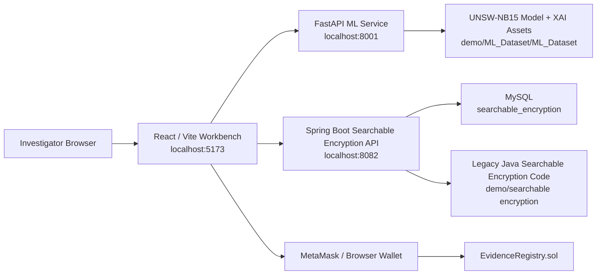

# Privacy-Preserving Digital Forensic System for Encrypted Data

This repository contains an integrated research prototype for privacy-preserving digital forensics over encrypted or privacy-sensitive network evidence. The system demonstrates how metadata-based intrusion analysis, explainable AI, searchable encrypted evidence storage, and blockchain hash notarization can be combined into one investigator-facing workflow.

The central design goal is to support useful forensic analysis without decrypting or storing raw user payloads. Instead of relying on deep packet inspection, the project analyzes traffic metadata from the UNSW-NB15 dataset, generates structured evidence only for suspicious traffic, encrypts the resulting evidence, supports protected keyword search, and anchors SHA-256 evidence hashes on chain.

## Contents

- [What the System Does](#what-the-system-does)
- [Architecture](#architecture)
- [Forensic Workflow](#forensic-workflow)
- [Repository Layout](#repository-layout)
- [Main Modules](#main-modules)
- [Technology Stack](#technology-stack)
- [Requirements](#requirements)
- [Configuration](#configuration)
- [Quick Start](#quick-start)
- [Stable Local Startup on Windows](#stable-local-startup-on-windows)
- [Using the Application](#using-the-application)
- [API Reference](#api-reference)
- [Machine Learning and XAI Assets](#machine-learning-and-xai-assets)
- [Searchable Encryption Design](#searchable-encryption-design)
- [Blockchain Evidence Registry](#blockchain-evidence-registry)
- [Validation and Testing](#validation-and-testing)
- [Troubleshooting](#troubleshooting)
- [Security Notes](#security-notes)
- [Project Scope](#project-scope)

## What the System Does

The platform implements a complete privacy-preserving digital forensic pipeline:

1. Lets an investigator register, sign in, and work through a browser interface.
2. Accepts network-flow feature JSON instead of raw packet payloads.
3. Sends the features to a FastAPI machine-learning service.
4. Uses a Random Forest forensic engine to classify traffic as normal or attack.
5. Returns prediction, probability values, feature-completeness counts, and a SHA-256 evidence hash.
6. Generates a structured forensic evidence JSON artifact only when attack traffic is detected.
7. Displays model performance and explainability assets such as SHAP, LIME, permutation importance, and PDP outputs.
8. Stores evidence text or files in an encrypted evidence vault.
9. Builds a searchable encrypted keyword index so investigators can search evidence without a plaintext keyword table.
10. Lets investigators preview, download, delete, or rebuild indexes for authorized evidence records.
11. Uses an Ethereum-compatible smart contract to notarize and verify evidence hashes.

## Architecture



The frontend is the main operator interface. The ML service performs prediction and serves model/XAI artifacts. The Spring Boot service exposes the searchable-encryption evidence vault as HTTP APIs while reusing the legacy Java implementation. The Solidity contract records evidence hash metadata on an Ethereum-compatible chain such as Ganache.

## Forensic Workflow

The system follows the digital forensic life cycle described in the project report.

### 1. Privacy-Preserving Data Collection

The project avoids payload inspection. It uses network traffic metadata such as protocol, connection state, duration, byte counts, and packet/flow statistics. This keeps the prototype aligned with data minimization: sensitive message content, passwords, and private communication payloads are not required for analysis.

### 2. Forensic Analysis

The FastAPI service loads exported UNSW-NB15 model assets and predicts whether submitted metadata represents benign or malicious traffic. The core model is a Random Forest classifier selected after comparison with Logistic Regression and MLP baselines.

When traffic is classified as normal, the frontend reports that no evidence needs to be saved. When traffic is classified as attack traffic, the frontend builds a structured JSON evidence artifact containing an evidence ID, timestamp, searchable keywords, forensic metrics, and the generated SHA-256 hash.

### 3. Explainable AI Review

The Explainable Forensics page retrieves XAI metadata, images, and report slices from the ML service. It supports SHAP, LIME, permutation importance, and partial dependence plot assets so that investigators can inspect the reasoning behind model behavior instead of treating predictions as an opaque black box.

### 4. Encrypted Evidence Storage and Search

The evidence vault encrypts uploaded text or files, extracts searchable terms where possible, creates protected keyword index entries, and stores encrypted content in MySQL. Later searches are normalized and matched against the encrypted index rather than a plaintext keyword table.

### 5. Blockchain Preservation

The blockchain module stores evidence hash metadata through `EvidenceRegistry.sol`. Only hashes and metadata are placed on chain, not full evidence files. This provides tamper-evident verification while avoiding the cost and privacy risk of storing evidence content on a public or shared ledger.

## Repository Layout

```text
.
|-- demo/
|   |-- ML_Dataset/
|   |   `-- ML_Dataset/
|   |       |-- Exported_Model_Assets/
|   |       |-- SHAP/
|   |       |-- LIME/
|   |       |-- Permutation_Importance/
|   |       |-- PDP/
|   |       `-- UNSW_NB15/
|   |-- blockchain-evidence/
|   |   |-- contracts/contracts/EvidenceRegistry.sol
|   |   `-- evidence/index.html
|   |-- model-code-and-datasets/
|   |   |-- Baseline_Logistic_Regression.ipynb
|   |   |-- MLP_Neural_Network.ipynb
|   |   |-- RF_forensic_analysis.ipynb
|   |   |-- Search_rf.ipynb
|   |   `-- unsw nb15/archive/
|   `-- searchable encryption/
|       |-- src/main/java/com/bdic/
|       |-- src/test/java/com/bdic/
|       `-- pom.xml
|-- integrated-forensic-platform/
|   |-- backend/
|   |   |-- ml-service/
|   |   |   |-- app/main.py
|   |   |   |-- requirements.txt
|   |   |   `-- Dockerfile
|   |   `-- searchable-encryption-api/
|   |       |-- src/main/java/com/bdic/web/
|   |       |-- src/main/resources/application.properties
|   |       |-- pom.xml
|   |       `-- Dockerfile
|   |-- contracts/
|   |   `-- EvidenceRegistry.sol
|   |-- frontend/
|   |   |-- public/model-analysis/
|   |   |-- src/components/
|   |   |-- src/lib/
|   |   |-- src/pages/
|   |   |-- package.json
|   |   `-- vite.config.ts
|   `-- docker-compose.yml
|-- .gitignore
`-- README.md
```

## Main Modules

### Frontend Workbench

Location: `integrated-forensic-platform/frontend`

The frontend is a React/Vite TypeScript application with authenticated investigator access. Its main pages are:

- `Dashboard`: system status, service availability, and workflow shortcuts.
- `Forensic Data Analysis`: JSON feature input, ML prediction, probability display, evidence hash, JSON evidence artifact generation, vault saving, and blockchain anchoring.
- `ML Model for Analysis`: Random Forest KPIs, confusion matrix, feature importance chart, and model comparison table.
- `Explainable Forensics`: SHAP, LIME, permutation importance, PDP images, and paginated evidence-report records.
- `Encrypted Evidence Vault`: upload, encrypted search, preview, download, delete, and index rebuild for evidence records.
- `On-Chain Evidence`: wallet connection, SHA-256 file/hash handling, EvidenceRegistry submission, and hash verification.

### FastAPI ML Service

Location: `integrated-forensic-platform/backend/ml-service`

The ML service loads exported assets from `demo/ML_Dataset/ML_Dataset` by default. It serves health checks, model metadata, prediction results, XAI images, and report slices. If the model files are unavailable, the code contains a simple fallback prediction path so that the API can remain usable for demonstration, but the intended mode is to load the exported Random Forest model.

Key model assets:

- `Exported_Model_Assets/Forensic_RandomForest_Engine.joblib`
- `Exported_Model_Assets/Forensic_StandardScaler.joblib`
- `Exported_Model_Assets/Feature_Names.json`
- XAI images and JSON reports under `SHAP`, `LIME`, `Permutation_Importance`, and `PDP`

### Searchable Encryption API

Location: `integrated-forensic-platform/backend/searchable-encryption-api`

This Spring Boot API wraps the legacy Java searchable-encryption implementation and exposes it as a browser-friendly REST service. It imports source code from `demo/searchable encryption/src/main/java` through Maven's `build-helper-maven-plugin`.

The API provides:

- investigator registration, login, password change, and password reset
- encrypted text and file upload
- document listing and owner-scoped retrieval
- protected keyword search
- preview and decrypted download
- document deletion
- searchable-index rebuild
- ML-service status and start facade

### Legacy Searchable Encryption Demo

Location: `demo/searchable encryption`

This is the original Java implementation. It contains cryptography utilities, PEKS-inspired searchable-index logic, DES demonstration encryption, database repositories, file text extraction, keyword extraction, document operation services, and tests.

Important source areas:

- `com/bdic/crypto/DESUtil.java`
- `com/bdic/crypto/PEKSUtil.java`
- `com/bdic/text/DocumentTextExtractor.java`
- `com/bdic/text/KeywordExtractor.java`
- `com/bdic/db/EncryptedDataRepository.java`
- `com/bdic/admin/DocumentOperationService.java`

### Blockchain Contract

Locations:

- `integrated-forensic-platform/contracts/EvidenceRegistry.sol`
- `demo/blockchain-evidence/contracts/contracts/EvidenceRegistry.sol`

The integrated platform uses `integrated-forensic-platform/contracts/EvidenceRegistry.sol`. The contract stores evidence records, maps hashes to submitters and record IDs, groups records by case ID, file name, and attack type, and supports hash verification.

## Technology Stack

| Layer | Technologies |
| --- | --- |
| Frontend | React 18, Vite 5, TypeScript, ethers.js, lucide-react |
| ML service | Python, FastAPI, Uvicorn, NumPy, Pandas, scikit-learn, joblib |
| Searchable encryption API | Java, Spring Boot 3.3.5, Maven, MySQL Connector/J, Apache PDFBox, Apache POI |
| Database | MySQL 8.x |
| Blockchain | Solidity `^0.8.28`, Ethereum-compatible wallet/network, ethers.js |
| Data and model assets | UNSW-NB15, exported Random Forest model, XAI outputs |
| Containerization | Docker Compose for MySQL, ML service, and Searchable Encryption API |

## Requirements

Install these tools for local development:

- Node.js 18 or newer
- npm
- Java 17 or newer
- Maven 3.6 or newer
- Python 3.11 or newer
- MySQL 8.x, unless using Docker Compose
- Docker Desktop, if using the Docker startup path
- Optional: Ganache, MetaMask, and Remix for the blockchain demo

Default ports:

| Service | URL |
| --- | --- |
| Frontend | `http://localhost:5173` |
| ML service | `http://localhost:8001` |
| Searchable Encryption API | `http://localhost:8082` |
| MySQL | `localhost:3306` |

## Configuration

### Frontend

Create `integrated-forensic-platform/frontend/.env.local` only when overriding defaults:

```env
VITE_ML_API_URL=http://localhost:8001
VITE_SE_API_URL=http://localhost:8082
VITE_DEFAULT_CONTRACT_ADDRESS=
```

If these variables are absent, the frontend uses the current browser host with ports `8001` and `8082`.

### Searchable Encryption API

The Spring Boot API reads database and recovery-code settings from environment variables or system properties.

| Variable | Default |
| --- | --- |
| `SE_DB_HOST` | `localhost` |
| `SE_DB_PORT` | `3306` |
| `SE_DB_NAME` | `searchable_encryption` |
| `SE_DB_USER` | `root` |
| `SE_DB_PASSWORD` | `123456ysy` |
| `SE_AUTH_RECOVERY_CODE` | `12345` |

Additional defaults in `application.properties`:

| Property | Default |
| --- | --- |
| `server.port` | `8082` |
| `ml.service.url` | `http://127.0.0.1:8001` |
| `ml.service.working-dir` | `../ml-service` |
| `ml.service.python` | `.venv/Scripts/python.exe` |

### ML Service

| Variable | Purpose |
| --- | --- |
| `FORENSIC_ML_ASSET_DIR` | Optional absolute path to `demo/ML_Dataset/ML_Dataset`. |

When `FORENSIC_ML_ASSET_DIR` is not set, the service searches parent directories for `demo/ML_Dataset/ML_Dataset`.

## Quick Start

### Backend Services with Docker Compose

Docker Compose starts MySQL, the ML service, and the Searchable Encryption API. The frontend is still started separately.

```powershell
cd integrated-forensic-platform
docker compose up --build
```

Then start the frontend:

```powershell
cd integrated-forensic-platform/frontend
npm install
npm run dev
```

Open:

```text
http://localhost:5173
```

Health checks:

```powershell
Invoke-WebRequest http://localhost:8001/health
Invoke-WebRequest http://localhost:8001/api/ml/metadata
Invoke-WebRequest http://localhost:8082/api/se/health
```

## Stable Local Startup on Windows

Use this path when Docker Desktop is unavailable or when running the services directly on Windows.

### 1. Start or Verify MySQL

```powershell
Get-Service MySQL80
Start-Service MySQL80
```

Expected database settings:

```text
host: localhost or 127.0.0.1
port: 3306
database: searchable_encryption
user: root
password: 123456ysy
```

The Java database layer creates required tables if they do not already exist.

### 2. Start the ML Service

```powershell
cd integrated-forensic-platform/backend/ml-service

if (!(Test-Path .venv)) {
  py -m venv .venv
}

.\.venv\Scripts\python.exe -m pip install -r requirements.txt

$env:FORENSIC_ML_ASSET_DIR = (Resolve-Path "../../../demo/ML_Dataset/ML_Dataset").Path
.\.venv\Scripts\python.exe -m uvicorn app.main:app --host 0.0.0.0 --port 8001
```

If the machine only has a newer Python version and pinned binary dependencies fail to install, refresh the compiled packages with versions compatible with the installed interpreter:

```powershell
.\.venv\Scripts\python.exe -m pip install --upgrade --force-reinstall fastapi pydantic pydantic-core starlette "uvicorn[standard]"
.\.venv\Scripts\python.exe -m pip install --upgrade --force-reinstall numpy pandas scipy scikit-learn joblib threadpoolctl
```

### 3. Start the Searchable Encryption API

```powershell
cd integrated-forensic-platform/backend/searchable-encryption-api

$env:SE_DB_HOST = "127.0.0.1"
$env:SE_DB_PORT = "3306"
$env:SE_DB_NAME = "searchable_encryption"
$env:SE_DB_USER = "root"
$env:SE_DB_PASSWORD = "123456ysy"

mvn spring-boot:run
```

### 4. Start the Frontend

```powershell
cd integrated-forensic-platform/frontend
npm install
npm run dev
```

Open:

```text
http://localhost:5173
```

### 5. Confirm Service Health

```powershell
Invoke-WebRequest http://localhost:5173
Invoke-WebRequest http://localhost:8001/health
Invoke-WebRequest http://localhost:8001/api/ml/metadata
Invoke-WebRequest http://localhost:8082/api/se/health
```

Expected ML health response includes:

```json
{
  "status": "ok",
  "model_available": true
}
```

## Using the Application

### 1. Sign In

Open `http://localhost:5173`, create an investigator account, and sign in. The default recovery code for password reset is `12345` unless overridden with `SE_AUTH_RECOVERY_CODE`.

### 2. Run Forensic Data Analysis

Open `Forensic Data Analysis`, paste feature JSON, and submit it to the ML service.

Example request body sent to the ML API:

```json
{
  "features": {
    "dur": 0.121,
    "sbytes": 496,
    "dbytes": 0,
    "sttl": 254,
    "proto_udp": 1,
    "state_INT": 1,
    "service_dns": 0
  }
}
```

The prediction response includes:

```json
{
  "prediction": 1,
  "probability": {
    "0": 0.012345,
    "1": 0.987655
  },
  "filled_feature_count": 15,
  "missing_feature_count": 181,
  "evidence_hash": "64-character-sha256-hex"
}
```

When `prediction` is `1`, the frontend creates an evidence artifact like:

```json
{
  "Evidence_ID": "EVID-0",
  "Timestamp": "2026-05-18T06:40:41.739Z",
  "Searchable_Keywords": [
    "PROTOCOL:udp",
    "SERVICE:-",
    "STATE:INT"
  ],
  "Forensic_Metrics": {
    "Protocol": "udp",
    "Service": "-",
    "Connection_State": "INT",
    "Source_Bytes": 496,
    "Destination_Bytes": 0,
    "Time_To_Live": 254
  },
  "Blockchain_SHA256_Hash": "ce822e57b30b1f6c4899266bcb9afe283e957e166161e90f50efc47041dbfce1"
}
```

The page can save the artifact into the encrypted vault and then submit the hash to `EvidenceRegistry` if a deployed contract address and wallet are available.

### 3. Review Model Analysis

Open `ML Model for Analysis` to inspect the fixed model-performance summary from the project assets.

| Model Engine | Accuracy | Precision | Recall | F1-Score |
| --- | ---: | ---: | ---: | ---: |
| Logistic Regression | 83.68% | 79.12% | 94.30% | 86.04% |
| Multi-Layer Perceptron | 86.18% | 80.95% | 97.20% | 88.33% |
| Random Forest Classifier | 86.93% | 81.47% | 98.72% | 89.27% |

Random Forest KPI cards:

- Accuracy: `86.93%`
- Recall / Attack Detection Rate: `98.72%`
- Precision: `81.47%`
- False Positive Rate: `27.51%`

Static chart assets:

```text
integrated-forensic-platform/frontend/public/model-analysis/
|-- Confusion_Matrix_Plot.png
`-- Feature_Importance_Plot.png
```

### 4. Inspect Explainable Forensics

Open `Explainable Forensics` to load:

- model availability and feature count from `/api/ml/metadata`
- XAI image assets from `/api/ml/assets/{folder}/{file}`
- paginated report entries from `/api/ml/reports/{method}`

Supported methods:

- `SHAP`
- `LIME`
- `Permutation_Importance`
- `PDP`

### 5. Use the Encrypted Evidence Vault

Open `Encrypted Evidence Vault` to:

- upload direct text
- upload one or more files
- upload folders through browser file selection
- extract text from supported file types
- generate searchable encrypted index entries
- search by keyword, prefix, file name, or extracted text
- preview supported records
- download decrypted original evidence
- delete records
- rebuild indexes after tokenization/index changes

The vault supports direct text, JSON-like text, PDF, Word documents, spreadsheets, images, and binary files. Search quality is strongest when text extraction is available, but file names and descriptions can still contribute searchable terms.

### 6. Anchor Evidence On Chain

Open `On-Chain Evidence` after deploying `EvidenceRegistry.sol` through Remix, Hardhat, or another Ethereum-compatible tool.

Workflow:

1. Connect MetaMask to the same network as the deployed contract.
2. Paste the deployed `EvidenceRegistry` contract address, not a wallet address.
3. Select an evidence file to compute SHA-256 automatically, or paste a 64-character SHA-256 hash.
4. Fill in case and evidence metadata.
5. Submit the evidence hash with `storeJSONEvidence`.
6. Verify a hash with `verifyEvidence`.

## API Reference

### ML Service

Base URL: `http://localhost:8001`

| Method | Endpoint | Purpose |
| --- | --- | --- |
| `GET` | `/health` | Service health, ML asset root, and model availability. |
| `GET` | `/api/ml/metadata` | Model availability, feature count, XAI assets, and report counts. |
| `POST` | `/api/ml/predict` | Predict from submitted feature JSON and return probability, counts, and evidence hash. |
| `GET` | `/api/ml/reports/{method}` | Return report entries for `SHAP`, `LIME`, `Permutation_Importance`, or `PDP`; supports `limit` and `offset`. |
| `GET` | `/api/ml/assets/{folder}/{file}` | Serve XAI and model image assets. |

### Searchable Encryption API

Base URL: `http://localhost:8082`

Authentication uses a bearer token returned by `/api/se/auth/login` or `/api/se/auth/register`.

| Method | Endpoint | Purpose |
| --- | --- | --- |
| `GET` | `/api/se/health` | Searchable Encryption API health. |
| `POST` | `/api/se/auth/register` | Create an investigator account. |
| `POST` | `/api/se/auth/login` | Create an authenticated session. |
| `POST` | `/api/se/auth/change-password` | Change the signed-in account password. |
| `POST` | `/api/se/auth/reset-password` | Reset password with recovery code. |
| `GET` | `/api/se/documents` | List current user's encrypted evidence documents. |
| `POST` | `/api/se/documents/upload` | Upload text or a file as encrypted evidence. |
| `GET` | `/api/se/documents/search?keyword=...` | Search protected keyword indexes. |
| `GET` | `/api/se/documents/{docId}` | Get metadata and preview data for one document. |
| `GET` | `/api/se/documents/{docId}/download` | Download decrypted evidence content. |
| `POST` | `/api/se/documents/{docId}/rebuild-index` | Regenerate searchable index entries. |
| `DELETE` | `/api/se/documents/{docId}` | Delete a document and related index rows. |

### ML Control Facade

Base URL: `http://localhost:8082`

| Method | Endpoint | Purpose |
| --- | --- | --- |
| `GET` | `/api/ml-control/status` | Report ML service status from the Spring Boot facade. |
| `POST` | `/api/ml-control/start` | Attempt to start the ML service process from the Spring Boot facade. |

## Machine Learning and XAI Assets

Primary asset directory:

```text
demo/ML_Dataset/ML_Dataset
```

Important folders:

- `Exported_Model_Assets`: Random Forest model, StandardScaler, feature names, and exported SHAP images.
- `SHAP`: SHAP feature importance, global importance, summary plot, attack sample explanation, and JSON report.
- `LIME`: LIME feature importance, attack sample explanation, global importance, and JSON report.
- `Permutation_Importance`: permutation importance images and JSON report.
- `PDP`: partial dependence plots and JSON report.
- `UNSW_NB15`: UNSW-NB15 dataset files and documentation.

The ML service expects model inputs to align with `Exported_Model_Assets/Feature_Names.json`.

## Searchable Encryption Design

The searchable evidence vault is designed to demonstrate how encrypted forensic evidence can remain usable for investigation.

Upload pipeline:

```text
evidence input -> normalization -> text extraction -> keyword extraction -> token expansion -> content encryption -> protected index creation -> MySQL persistence
```

Search pipeline:

```text
query -> normalization -> protected query token generation -> encrypted-index comparison -> owner-scoped candidate records -> preview or download
```

Key implementation details:

- Evidence content is encrypted before persistence.
- Keyword metadata is protected rather than stored as a plaintext keyword table.
- The index uses a PEKS-inspired teaching-level searchable-index workflow.
- Search terms are normalized consistently at upload and query time.
- Prefix tokens improve practical English-style partial matching.
- CJK fragments improve practical search behavior for Chinese/Japanese/Korean text.
- The system supports index rebuilds so existing records can be reindexed after tokenization logic changes.

Important limitation: this prototype demonstrates searchable-encryption concepts in an applied forensic workflow. It is not a formally verified production cryptosystem. The legacy encryption layer uses DES for demonstration, and the searchable index leaks practical metadata such as equality patterns, search patterns, access patterns, document size, and approximate token volume. A production system should replace this layer with authenticated encryption such as AES-GCM or ChaCha20-Poly1305, stronger key management, and a more rigorous searchable-encryption construction.

## Blockchain Evidence Registry

Contract: `integrated-forensic-platform/contracts/EvidenceRegistry.sol`

Important functions:

| Function | Purpose |
| --- | --- |
| `storeEvidence(caseId, evidenceHash, evidenceName, description)` | Store a basic hash record. |
| `storeJSONEvidence(caseId, fileHash, evidenceName, description, fileName, attackType, sourceIp, targetUrl)` | Store evidence hash and structured JSON/file metadata. |
| `verifyEvidence(evidenceHash)` | Return whether a hash exists on chain. |
| `getRecord(recordId)` | Read one evidence record. |
| `getEvidenceByAttackType(attackType)` | Read records grouped by attack type. |
| `getTotalRecords()` | Return total stored records. |

The contract checks for duplicate evidence hashes and requires a 64-character hash string for basic evidence storage. The frontend also validates contract address format, confirms deployed bytecode exists at the address, and warns when a wallet account address is pasted instead of a contract address.

## Validation and Testing

Frontend build:

```powershell
cd integrated-forensic-platform/frontend
npm run build
```

Spring Boot API build:

```powershell
cd integrated-forensic-platform/backend/searchable-encryption-api
mvn -DskipTests package
```

Spring Boot tests:

```powershell
cd integrated-forensic-platform/backend/searchable-encryption-api
mvn test
```

Legacy searchable-encryption tests:

```powershell
cd "demo/searchable encryption"
mvn test
```

ML smoke checks:

```powershell
Invoke-WebRequest http://localhost:8001/health
Invoke-WebRequest http://localhost:8001/api/ml/metadata
```

Searchable Encryption API smoke check:

```powershell
Invoke-WebRequest http://localhost:8082/api/se/health
```

The report validation describes coverage across direct text, JSON-style text, PDF, Word document, spreadsheet, image, and binary evidence inputs. Search validation covers single-keyword, multi-keyword, file-name, prefix-token, and CJK-fragment queries.

## Troubleshooting

### Frontend Cannot Connect to Backend Services

Confirm `.env.local` values if you created the file:

```env
VITE_ML_API_URL=http://localhost:8001
VITE_SE_API_URL=http://localhost:8082
```

Then confirm all services are reachable:

```powershell
Invoke-WebRequest http://localhost:5173
Invoke-WebRequest http://localhost:8001/health
Invoke-WebRequest http://localhost:8082/api/se/health
```

### ML Service Starts but Model Is Unavailable

Confirm the asset directory exists:

```text
demo/ML_Dataset/ML_Dataset
```

Confirm these files are present:

```text
Exported_Model_Assets/Forensic_RandomForest_Engine.joblib
Exported_Model_Assets/Forensic_StandardScaler.joblib
Exported_Model_Assets/Feature_Names.json
```

Set the asset directory explicitly if needed:

```powershell
$env:FORENSIC_ML_ASSET_DIR = (Resolve-Path "../../../demo/ML_Dataset/ML_Dataset").Path
```

### Python Dependency Installation Fails

If Python is newer than the pinned versions in `requirements.txt`, NumPy or other binary packages may not have matching wheels. Use Python 3.11 or 3.12 where possible. If only a newer Python version is installed, reinstall compatible binary packages as shown in the Windows startup section.

### Searchable Encryption API Cannot Connect to MySQL

Confirm MySQL is running and credentials match:

```text
SE_DB_HOST=localhost
SE_DB_PORT=3306
SE_DB_NAME=searchable_encryption
SE_DB_USER=root
SE_DB_PASSWORD=123456ysy
```

When using Docker Compose, the Spring Boot container uses:

```text
SE_DB_HOST=mysql
```

### Login or Password Reset Fails

Create a new account from the login page if no user exists. The default password recovery code is:

```text
12345
```

Override it with `SE_AUTH_RECOVERY_CODE` for non-demo use.

### On-Chain Verification Fails

Common causes:

- MetaMask is not installed or not connected.
- The contract address field contains a wallet address instead of the deployed `EvidenceRegistry` contract address.
- MetaMask is connected to a different network from the deployed contract.
- The evidence hash is not a 64-character SHA-256 hex string.
- The selected hash has not been submitted on chain yet.

### File Preview Is Unavailable

Some file types can be stored and downloaded but cannot be previewed inline. Use Download to inspect the decrypted original file.

## Security Notes

This repository is a research and demonstration prototype. Before production use, review and harden:

- default database password
- default password recovery code
- local key storage and lifecycle
- session expiration and token persistence
- transport security between browser and services
- evidence access control and audit logging
- encrypted search leakage profile
- DES demonstration encryption in the legacy module
- searchable-encryption construction and formal security assumptions
- smart-contract deployment network, wallet policy, and gas/cost model
- handling of personal data in uploaded evidence

Do not use the default passwords, local test keys, or Ganache-only blockchain workflow for real forensic evidence.

## Project Scope

This project was implemented as an integrated academic prototype. The report divides the work across four major forensic lifecycle areas:

- metadata-based data preparation and core ML forensic analysis
- explainable AI model transparency
- searchable encrypted evidence storage and frontend integration
- blockchain-based hash preservation and verification

Together, these modules show how privacy-preserving forensic readiness can be built into a modern encrypted-data investigation workflow while keeping the privacy and production-security limitations explicit.
