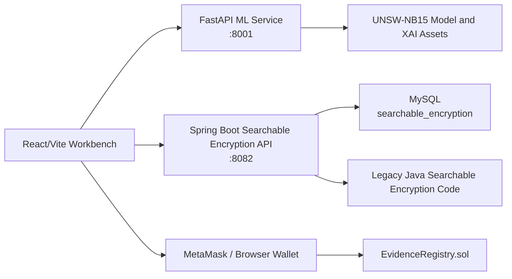

# Privacy-Preserving Digital Forensic System for Encrypted Data

This repository contains an integrated prototype for privacy-preserving digital forensics over encrypted evidence. It combines a React/Vite investigation workbench, a FastAPI machine-learning service for forensic data analysis, a Spring Boot searchable-encryption evidence vault, and a Solidity smart contract for on-chain evidence hash notarization.

The system is designed for research, demonstration, and implementation study. It shows how network-flow analysis, explainable AI artifacts, searchable encryption, encrypted file storage, and blockchain anchoring can be assembled into a single forensic workflow.

## Table of Contents

- [What the System Does](#what-the-system-does)
- [Architecture](#architecture)
- [Repository Layout](#repository-layout)
- [Main Modules](#main-modules)
- [Requirements](#requirements)
- [Configuration](#configuration)
- [Quick Start with Docker for Backend Services](#quick-start-with-docker-for-backend-services)
- [Local Development Setup](#local-development-setup)
- [Using the Application](#using-the-application)
- [API Reference](#api-reference)
- [Machine Learning Assets](#machine-learning-assets)
- [Blockchain Contract](#blockchain-contract)
- [Validation and Testing](#validation-and-testing)
- [Troubleshooting](#troubleshooting)
- [Security Notes](#security-notes)

## What the System Does

The platform supports the following end-to-end workflow:

1. Register or sign in as an investigator.
2. Submit network traffic features to the forensic ML service.
3. Review the predicted class, probability values, evidence hash, and structured forensic evidence JSON.
4. Review model-level performance through the ML Model for Analysis dashboard.
5. Browse SHAP, LIME, permutation importance, and PDP explainability assets.
6. Upload plaintext or files into the encrypted evidence vault.
7. Search encrypted evidence by keywords without exposing plaintext search indexes.
8. Preview or download decrypted evidence after authorization.
9. Anchor SHA-256 evidence hashes on-chain through the `EvidenceRegistry` smart contract.
10. Verify whether a submitted evidence hash exists on-chain.

## Architecture



The frontend is the main operator interface. The ML service performs prediction and serves explainability artifacts. The Spring Boot service wraps the legacy Java searchable-encryption implementation and exposes it as a web API. The Solidity contract records evidence hash metadata on an Ethereum-compatible chain such as Ganache.

## Repository Layout

```text
.
|-- demo/
|   |-- ML_Dataset/
|   |   `-- ML_Dataset/
|   |       |-- Exported_Model_Assets/
|   |       |-- SHAP/
|   |       |-- LIME/
|   |       |-- Permutation_Importance/
|   |       |-- PDP/
|   |       `-- UNSW_NB15/
|   `-- searchable encryption/
|       |-- src/main/java/
|       |-- src/test/java/
|       `-- pom.xml
|-- integrated-forensic-platform/
|   |-- backend/
|   |   |-- ml-service/
|   |   |   |-- app/main.py
|   |   |   |-- requirements.txt
|   |   |   `-- Dockerfile
|   |   `-- searchable-encryption-api/
|   |       |-- src/main/java/com/bdic/web/
|   |       |-- src/main/resources/application.properties
|   |       |-- pom.xml
|   |       `-- Dockerfile
|   |-- contracts/
|   |   `-- EvidenceRegistry.sol
|   |-- frontend/
|   |   |-- public/model-analysis/
|   |   |-- src/components/
|   |   |-- src/lib/
|   |   |-- src/pages/
|   |   |-- package.json
|   |   `-- vite.config.ts
|   `-- docker-compose.yml
`-- README.md
```

## Main Modules

### Frontend Workbench

Location: `integrated-forensic-platform/frontend`

Technology stack:

- React 18
- Vite 5
- TypeScript
- ethers.js
- lucide-react icons

Pages:

- `Workbench`: system status, ML service status, workflow shortcuts, and module overview.
- `Forensic Data Analysis`: network traffic feature input, prediction output, probability display, evidence hash, and structured forensic evidence JSON artifact.
- `ML Model for Analysis`: Random Forest performance KPI cards, confusion matrix, global feature importance chart, and LR/MLP/RF model comparison table.
- `Explainable Forensics`: SHAP, LIME, permutation importance, PDP image assets, and forensic evidence report JSON browser.
- `Encrypted Evidence Vault`: upload, search, preview, download, rebuild index, and delete encrypted evidence records.
- `On-Chain Evidence`: compute or paste SHA-256 evidence hashes, submit metadata to `EvidenceRegistry`, and verify stored hashes.

### FastAPI ML Service

Location: `integrated-forensic-platform/backend/ml-service`

The ML service loads exported assets from `demo/ML_Dataset/ML_Dataset` by default:

- `Forensic_RandomForest_Engine.joblib`
- `Forensic_StandardScaler.joblib`
- `Feature_Names.json`
- XAI plot images
- JSON forensic evidence reports

If model assets are unavailable, the service still starts and falls back to a simple rule-based prediction path in `app/main.py`.

### Searchable Encryption API

Location: `integrated-forensic-platform/backend/searchable-encryption-api`

Technology stack:

- Java 17
- Spring Boot 3.3.5
- Maven
- MySQL Connector/J 8.4
- Apache PDFBox
- Apache POI

The Spring Boot API imports the legacy Java source tree from `demo/searchable encryption/src/main/java` through Maven's `build-helper-maven-plugin`. It reuses the legacy DES encryption, PEKS keyword encryption, database repositories, file text extraction, and document operation logic behind HTTP endpoints.

### Legacy Searchable Encryption Demo

Location: `demo/searchable encryption`

This is the original Java implementation used by the integrated API. It includes cryptography utilities, database access, a legacy server/client UI, model classes, and unit tests.

### Blockchain Contract

Location: `integrated-forensic-platform/contracts/EvidenceRegistry.sol`

The contract stores evidence hash metadata and supports hash verification. The frontend calls the contract through ethers.js and a browser wallet.

## Requirements

Install the following for local development:

- Java 17
- Maven 3.9 or newer
- Node.js 18 or newer
- npm
- Python 3.11
- Docker Desktop, if using Docker Compose
- MySQL 8.x, if not using Docker Compose
- Optional: Ganache, MetaMask, and Remix for the blockchain demo

Default service ports:

| Service | Default URL |
| --- | --- |
| Frontend | `http://localhost:5173` |
| ML service | `http://localhost:8001` |
| Searchable Encryption API | `http://localhost:8082` |
| MySQL | `localhost:3306` |

## Configuration

### Frontend Environment

Create `integrated-forensic-platform/frontend/.env.local` when overriding defaults:

```env
VITE_ML_API_URL=http://localhost:8001
VITE_SE_API_URL=http://localhost:8082
VITE_DEFAULT_CONTRACT_ADDRESS=
```

The frontend login flow uses the Searchable Encryption API. Create an investigator account from the login screen, then use that account to access the platform.

### Searchable Encryption API Environment

The API reads database settings from system properties or environment variables. Defaults are shown below:

| Variable | Default |
| --- | --- |
| `SE_DB_HOST` | `localhost` |
| `SE_DB_PORT` | `3306` |
| `SE_DB_NAME` | `searchable_encryption` |
| `SE_DB_USER` | `root` |
| `SE_DB_PASSWORD` | `123456ysy` |
| `SE_AUTH_RECOVERY_CODE` | `12345` |

The API also has ML-control defaults in `application.properties`:

| Property | Default |
| --- | --- |
| `server.port` | `8082` |
| `ml.service.url` | `http://127.0.0.1:8001` |
| `ml.service.working-dir` | `../ml-service` |
| `ml.service.python` | `.venv/Scripts/python.exe` |

### ML Service Environment

| Variable | Purpose |
| --- | --- |
| `FORENSIC_ML_ASSET_DIR` | Optional absolute path to `demo/ML_Dataset/ML_Dataset`. |

When this variable is not set, the service searches parent directories for `demo/ML_Dataset/ML_Dataset`.

## Quick Start with Docker for Backend Services

Docker Compose starts MySQL, the ML service, and the Searchable Encryption API. The frontend is still run separately with Vite.

```powershell
cd integrated-forensic-platform
docker compose up --build
```

Then start the frontend:

```powershell
cd integrated-forensic-platform/frontend
npm install
npm run dev
```

Open:

```text
http://localhost:5173
```

Backend health checks:

```powershell
Invoke-WebRequest http://localhost:8001/health
Invoke-WebRequest http://localhost:8082/api/se/health
```

## Recommended Stable Local Startup on Windows

Use this flow when Docker Desktop is not available or when you want the most stable local demo startup. The ML service is intentionally started without `--reload`; the reload process can leave a parent process alive while the worker has crashed, which makes the frontend report the ML service as offline.

Run all commands from PowerShell.

### 1. Confirm MySQL is running

```powershell
Get-Service MySQL80
```

If it is stopped:

```powershell
Start-Service MySQL80
```

Expected database settings:

```text
host: localhost
port: 3306
database: searchable_encryption
user: root
password: 123456ysy
```

### 2. Start the ML service in stable mode

```powershell
cd integrated-forensic-platform/backend/ml-service

if (!(Test-Path .venv)) {
  python -m venv .venv
}

.\.venv\Scripts\python.exe -m pip install -r requirements.txt

$env:FORENSIC_ML_ASSET_DIR = (Resolve-Path "../../../demo/ML_Dataset/ML_Dataset").Path
.\.venv\Scripts\python.exe -m uvicorn app.main:app --host 0.0.0.0 --port 8001
```

If this machine only has Python 3.14 and imports fail with `cp312` or another binary-wheel mismatch, refresh the compiled dependencies once:

```powershell
.\.venv\Scripts\python.exe -m pip install --upgrade --force-reinstall fastapi pydantic pydantic-core starlette
.\.venv\Scripts\python.exe -m pip install --upgrade --force-reinstall numpy pandas scipy scikit-learn joblib threadpoolctl
```

### 3. Start the Searchable Encryption API

```powershell
cd integrated-forensic-platform/backend/searchable-encryption-api

$env:SE_DB_HOST = "127.0.0.1"
$env:SE_DB_PORT = "3306"
$env:SE_DB_NAME = "searchable_encryption"
$env:SE_DB_USER = "root"
$env:SE_DB_PASSWORD = "123456ysy"

mvn spring-boot:run
```

### 4. Start the frontend

```powershell
cd integrated-forensic-platform/frontend
npm install
npm run dev
```

Open:

```text
http://localhost:5173
```

### 5. Health checks

```powershell
Invoke-WebRequest http://localhost:5173
Invoke-WebRequest http://localhost:8001/health
Invoke-WebRequest http://localhost:8001/api/ml/metadata
Invoke-WebRequest http://localhost:8082/api/se/health
```

Expected ports:

```text
Frontend: http://localhost:5173
ML service: http://localhost:8001
Searchable Encryption API: http://localhost:8082
MySQL: localhost:3306
```

## Local Development Setup

The commands below use Windows PowerShell because the repository is currently set up on Windows. Equivalent shell commands work on macOS or Linux with path syntax adjusted.

### 1. Start MySQL

If MySQL is already installed locally, use:

```text
host: localhost
port: 3306
database: searchable_encryption
user: root
password: 123456ysy
```

Or start only MySQL through Docker:

```powershell
cd integrated-forensic-platform
docker compose up -d mysql
```

The Java database layer creates the `searchable_encryption` database and required tables if needed.

### 2. Start the ML Service

```powershell
cd integrated-forensic-platform/backend/ml-service
python -m venv .venv
.\.venv\Scripts\Activate.ps1
pip install -r requirements.txt

$env:FORENSIC_ML_ASSET_DIR = (Resolve-Path "../../../demo/ML_Dataset/ML_Dataset")
uvicorn app.main:app --host 0.0.0.0 --port 8001
```

Check the service:

```powershell
Invoke-WebRequest http://localhost:8001/health
Invoke-WebRequest http://localhost:8001/api/ml/metadata
```

### 3. Start the Searchable Encryption API

```powershell
cd integrated-forensic-platform/backend/searchable-encryption-api

$env:SE_DB_HOST = "localhost"
$env:SE_DB_PORT = "3306"
$env:SE_DB_NAME = "searchable_encryption"
$env:SE_DB_USER = "root"
$env:SE_DB_PASSWORD = "123456ysy"

mvn spring-boot:run
```

Check the service:

```powershell
Invoke-WebRequest http://localhost:8082/api/se/health
```

Alternative package-and-run flow:

```powershell
mvn -DskipTests package
java -jar target/searchable-encryption-api-0.1.0.jar
```

### 4. Start the Frontend

```powershell
cd integrated-forensic-platform/frontend
npm install
npm run dev
```

Open:

```text
http://localhost:5173
```

## Using the Application

### Account Access

1. Open the frontend.
2. Choose `Create one` on the login page to register an investigator account.
3. Sign in with that account.
4. If a password is forgotten, use the recovery code configured by `SE_AUTH_RECOVERY_CODE`. The default is `12345`.

### Forensic Data Analysis

1. Start the ML service from the workbench if it is offline.
2. Open `Forensic Data Analysis`.
3. Submit JSON network-flow features.
4. Review:
   - predicted class
   - probability values
   - filled and missing feature counts
   - evidence SHA-256 hash
   - structured forensic evidence JSON artifact
5. Optionally save the generated artifact to the encrypted vault and anchor it on-chain.

The generated evidence JSON follows this structure:

```json
{
  "Evidence_ID": "EVID-0",
  "Timestamp": "2026-05-18T06:40:41.739Z",
  "Searchable_Keywords": [
    "PROTOCOL:udp",
    "SERVICE:-",
    "STATE:INT"
  ],
  "Forensic_Metrics": {
    "Protocol": "udp",
    "Service": "-",
    "Connection_State": "INT",
    "Source_Bytes": 496,
    "Destination_Bytes": 0,
    "Time_To_Live": 254
  },
  "Blockchain_SHA256_Hash": "ce822e57b30b1f6c4899266bcb9afe283e957e166161e90f50efc47041dbfce1"
}
```

### ML Model for Analysis

The page presents fixed model evaluation data from the current project assets:

| Model Engine | Accuracy | Precision | Recall (Attack Det.) | F1-Score |
| --- | ---: | ---: | ---: | ---: |
| Logistic Regression (Linear Baseline) | 83.68% | 79.12% | 94.30% | 86.04% |
| Multi-Layer Perceptron (Neural Baseline) | 86.18% | 80.95% | 97.20% | 88.33% |
| Random Forest Classifier (Our Core Engine) | 86.93% | 81.47% | 98.72% | 89.27% |

The Random Forest KPI cards show:

- Accuracy: 86.93%
- Recall / Attack Detection Rate: 98.72%
- Precision: 81.47%
- False Positive Rate: 27.51%

Static chart assets are served from:

```text
integrated-forensic-platform/frontend/public/model-analysis/
|-- Confusion_Matrix_Plot.png
`-- Feature_Importance_Plot.png
```

### Explainable Forensics

This page loads ML metadata from the FastAPI service and displays available images from:

- `SHAP`
- `LIME`
- `Permutation_Importance`
- `PDP`
- `Exported_Model_Assets`

It also displays paginated forensic report JSON entries through `/api/ml/reports/{method}`.

### Encrypted Evidence Vault

The vault supports:

- uploading plaintext evidence
- importing files or folders
- extracting text for searchable indexes
- encrypting evidence content
- creating encrypted PEKS keyword indexes
- listing uploaded documents
- keyword search
- inline preview for supported media types
- decrypted download
- index rebuild
- deletion

Supported preview paths include text, JSON, code-like files, images, PDFs, spreadsheets, and extracted document text where available.

### On-Chain Evidence

1. Deploy `integrated-forensic-platform/contracts/EvidenceRegistry.sol` with Remix, Hardhat, or another Ethereum-compatible tool.
2. Connect MetaMask to the same network.
3. Paste the deployed contract address into the frontend.
4. Select an evidence file or paste a 64-character SHA-256 hash.
5. Submit evidence metadata with `storeJSONEvidence`.
6. Verify evidence hashes with `verifyEvidence`.

## API Reference

### ML Service

Base URL: `http://localhost:8001`

| Method | Endpoint | Purpose |
| --- | --- | --- |
| `GET` | `/health` | Service health and model availability. |
| `GET` | `/api/ml/metadata` | Model metadata, feature count, report counts, and available XAI assets. |
| `POST` | `/api/ml/predict` | Predict from submitted feature JSON and return probability, counts, and evidence hash. |
| `GET` | `/api/ml/reports/{method}` | Return forensic report entries for `SHAP`, `LIME`, `Permutation_Importance`, or `PDP`. |
| `GET` | `/api/ml/assets/{folder}/{file}` | Serve static ML/XAI image assets. |

Prediction request:

```json
{
  "features": {
    "dur": 0.121,
    "sbytes": 496,
    "dbytes": 0,
    "sttl": 254,
    "proto_udp": 1,
    "state_INT": 1,
    "service_dns": 0
  }
}
```

Prediction response:

```json
{
  "prediction": 1,
  "probability": {
    "0": 0.012345,
    "1": 0.987655
  },
  "filled_feature_count": 15,
  "missing_feature_count": 181,
  "evidence_hash": "64-character-sha256-hex"
}
```

### Searchable Encryption API

Base URL: `http://localhost:8082`

Authentication uses a bearer token returned by `/api/se/auth/login` or `/api/se/auth/register`.

| Method | Endpoint | Purpose |
| --- | --- | --- |
| `GET` | `/api/se/health` | Service health. |
| `POST` | `/api/se/auth/register` | Create an investigator account. |
| `POST` | `/api/se/auth/login` | Create an authenticated session. |
| `POST` | `/api/se/auth/change-password` | Change the current account password. |
| `POST` | `/api/se/auth/reset-password` | Reset password with recovery code. |
| `GET` | `/api/se/documents` | List current user's encrypted evidence documents. |
| `POST` | `/api/se/documents/upload` | Upload text or a file as encrypted evidence. |
| `GET` | `/api/se/documents/search?keyword=...` | Search encrypted keyword indexes. |
| `GET` | `/api/se/documents/{docId}` | Get metadata and preview data for one document. |
| `GET` | `/api/se/documents/{docId}/download` | Download decrypted evidence content. |
| `POST` | `/api/se/documents/{docId}/rebuild-index` | Rebuild or migrate searchable indexes. |
| `DELETE` | `/api/se/documents/{docId}` | Delete a document. |
| `GET` | `/api/ml-control/status` | Report ML service status from the Spring Boot control facade. |
| `POST` | `/api/ml-control/start` | Start the ML service process from the Spring Boot facade. |

### EvidenceRegistry Contract

Important functions:

| Function | Purpose |
| --- | --- |
| `storeEvidence(caseId, evidenceHash, evidenceName, description)` | Store a basic evidence hash record. |
| `storeJSONEvidence(caseId, fileHash, evidenceName, description, fileName, attackType, sourceIp, targetUrl)` | Store evidence hash and JSON/file metadata. |
| `verifyEvidence(evidenceHash)` | Return whether a hash exists. |
| `getRecord(recordId)` | Read one evidence record. |
| `getEvidenceByAttackType(attackType)` | Read records grouped by attack type. |
| `getTotalRecords()` | Return total stored records. |

## Machine Learning Assets

The ML assets are located under:

```text
demo/ML_Dataset/ML_Dataset
```

Key folders:

- `Exported_Model_Assets`: Random Forest model, StandardScaler, feature names, and exported SHAP images.
- `SHAP`: SHAP feature importance, global importance, summary plot, attack sample explanation, and JSON report.
- `LIME`: LIME feature importance, attack sample explanation, global importance, and JSON report.
- `Permutation_Importance`: permutation importance images and JSON report.
- `PDP`: partial dependence plots and JSON report.
- `UNSW_NB15`: UNSW-NB15 dataset materials.

The FastAPI service expects model features to match `Exported_Model_Assets/Feature_Names.json`.

## Blockchain Contract

The contract uses Solidity `^0.8.28` and stores evidence records in an array plus lookup mappings:

- `hashExists`
- `caseRecords`
- `hashToSubmitter`
- `hashToRecordId`
- `fileNameExists`
- `attackTypeRecords`
- `fileNameRecords`

The frontend validates that the address is a deployed contract before calling read/write functions.

## Validation and Testing

Frontend build:

```powershell
cd integrated-forensic-platform/frontend
npm run build
```

Spring Boot API build:

```powershell
cd integrated-forensic-platform/backend/searchable-encryption-api
mvn -DskipTests package
```

Spring Boot tests:

```powershell
cd integrated-forensic-platform/backend/searchable-encryption-api
mvn test
```

Legacy searchable-encryption tests:

```powershell
cd "demo/searchable encryption"
mvn test
```

ML service smoke checks:

```powershell
Invoke-WebRequest http://localhost:8001/health
Invoke-WebRequest http://localhost:8001/api/ml/metadata
```

Searchable Encryption API smoke check:

```powershell
Invoke-WebRequest http://localhost:8082/api/se/health
```

## Troubleshooting

### Frontend cannot connect to ML or SE API

Check `.env.local` in `integrated-forensic-platform/frontend` and confirm the services are running:

```text
VITE_ML_API_URL=http://localhost:8001
VITE_SE_API_URL=http://localhost:8082
```

### ML service starts but model is unavailable

Confirm `FORENSIC_ML_ASSET_DIR` points to:

```text
demo/ML_Dataset/ML_Dataset
```

Also confirm these files exist:

```text
Exported_Model_Assets/Forensic_RandomForest_Engine.joblib
Exported_Model_Assets/Forensic_StandardScaler.joblib
Exported_Model_Assets/Feature_Names.json
```

### Searchable Encryption API cannot connect to MySQL

Confirm MySQL is running and credentials match:

```text
SE_DB_HOST=localhost
SE_DB_PORT=3306
SE_DB_NAME=searchable_encryption
SE_DB_USER=root
SE_DB_PASSWORD=123456ysy
```

When using Docker Compose, the Spring Boot container uses `SE_DB_HOST=mysql`.

### On-chain verification fails

Common causes:

- MetaMask is not connected.
- The contract address is a wallet address, not the deployed contract address.
- MetaMask is on a different network from the deployed contract.
- The pasted hash is not a 64-character SHA-256 hex string.
- The selected evidence hash has not been stored yet.

### File preview is unavailable

Some file types are stored and downloadable but cannot be previewed inline. Use Download to inspect the decrypted original file.

## Security Notes

This is a research and demonstration system. Before production use, review and harden:

- default database password
- default recovery code
- local key storage under the user home directory
- session lifetime and token persistence
- transport security between browser and backend services
- access control and audit logging
- smart-contract deployment network and wallet policy
- cryptographic choices and key lifecycle management

Do not use the default passwords, local test keys, or Ganache-only workflows for real forensic evidence.
